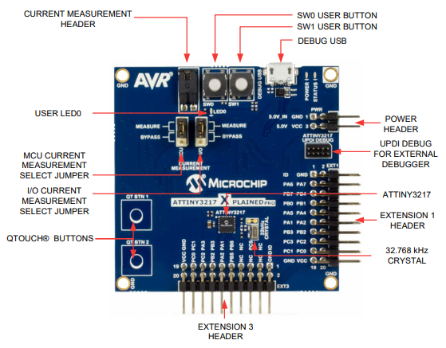

# TouchPad Example using QT8 and ATtiny3217 Xplained Pro kit

This example demonstrates touch application on ATtiny3217 XPRO with QT8 surface extension board. The example project provides user feedback to touch either using the QT8 onboard LEDS, or via a PC running Microchip 2D Surface Utility via USB.

## Related Documentation

- ATtiny3217 Xplainedpro kit user guide [(DS50002765A)](https://ww1.microchip.com/downloads/en/DeviceDoc/ATtiny3217-Xplained-Pro-DS50002765A.pdf)
- 2D Surface Utility guide [(Microchipdeveloper)](https://microchipdeveloper.com/touch:guide-to-connect-to-touch-surface-utility)

## Software Used
  
- Microchip Studio 7 7.0.2542 or later [(microchip-studio-for-avr-and-sam-devices)](https://www.microchip.com/en-us/development-tools-tools-and-software/microchip-studio-for-avr-and-sam-devices)
- AVR-GCC 3.62 or newer toolchain [(Toolchains for AVR)](https://www.microchip.com/en-us/development-tools-tools-and-software/gcc-compilers-avr-and-arm)
- ATtiny_DFP (1.8.322) or later [(packs.download.microchip.com)](https://packs.download.microchip.com/)
- 2D Surface Utility [(2D Touch Surface GUI)](https://www.microchip.com/mymicrochip/filehandler.aspx?ddocname=en605897)
  
## Hardware Used

- ATtiny3217 Xplained Pro [(ATTINY3217-XPRO)](https://www.microchip.com/DevelopmentTools/ProductDetails/PartNO/ATTINY3217-XPRO)
- QT8 Xplained Pro Extension Kit [(AC164161)](https://www.microchip.com/developmenttools/ProductDetails/AC164161)

[]

## Setup

1. Remove R303 from the ATtiny3217 Xplained Pro, located beside USER LED0 (see above).
2. Connect the QT8 to ATtiny3217 Xplained Pro kit Extension Header 1.
3. Connect PC to the MCU board Debug USB port. 

## Operation

1. Open the .atsln file in Microchip Studio.
2. Build the solution and program the device.
3. By default, UART communication is enabled to send data to Microchip Surface Utility (KRONOCOMM_UART macro in touch.h file is 1u).
4. Open Microchip 2D Touch Surface Utility and select UART with 38400 baud rate and click OK.
5. Surface status will be displayed on the utility.
6. To enable LED status:
   - Disable the UART communication by setting KRONOCOMM_UART macro to 0u in touch.h file
   - Enable LED driver by setting ENABLE_LED macro to 1u in led_driver.c file
7. Close the 2D Surface Utility.
8. Rebuild and program the target.    
    NOTE: Either LED or Kronocomm should be enabled, not both simultaneously. Running both will cause 2D utility debug data transmission to be delayed. 

## Summary

This example has illustrated how to use the ATtiny3217 XPRO with QT8 surface extension board.
